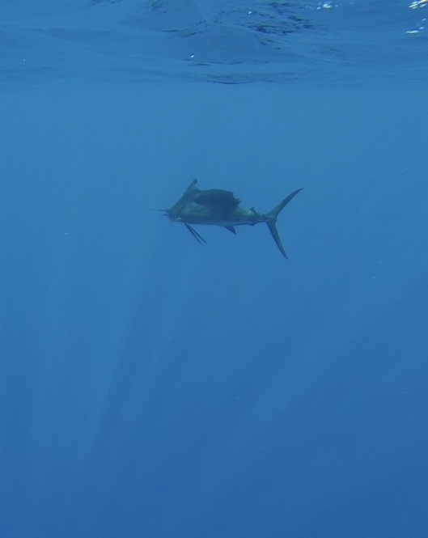
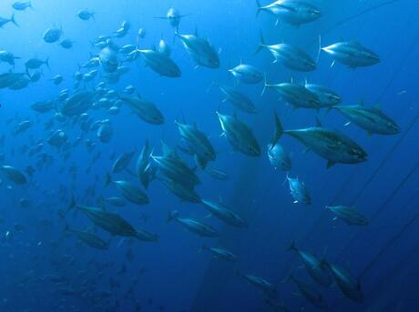
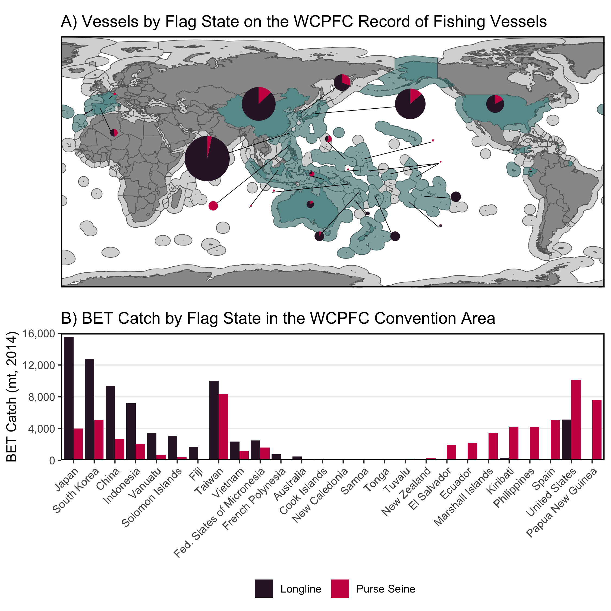
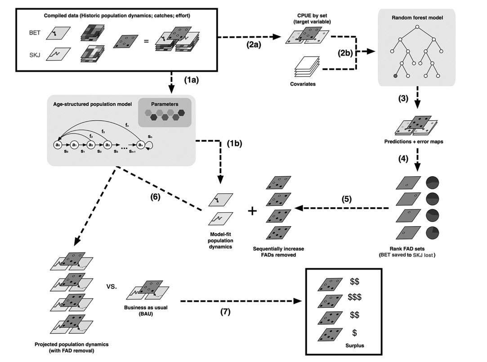
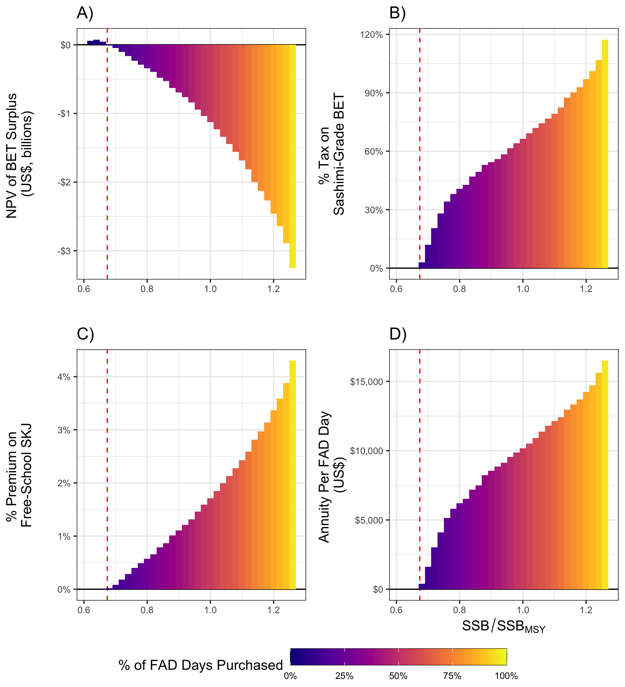
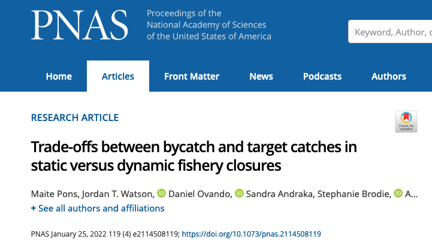
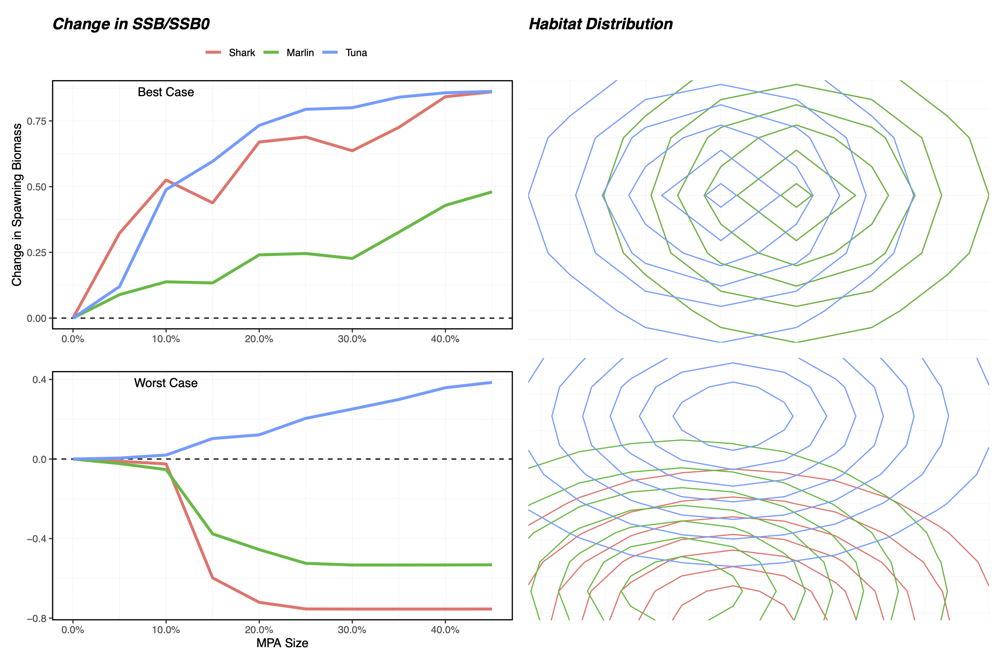
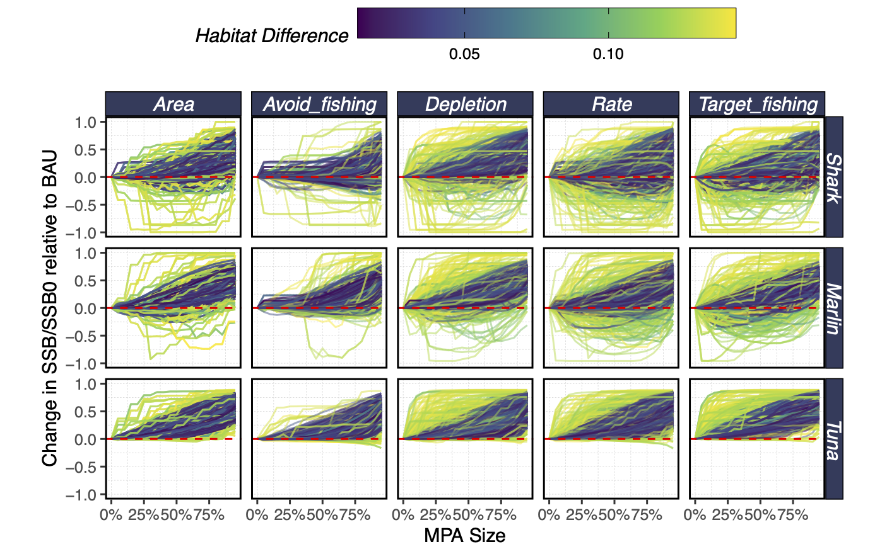
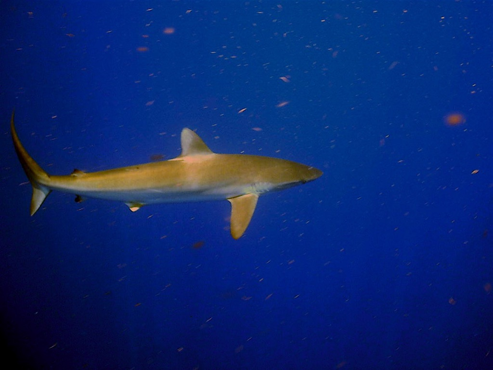
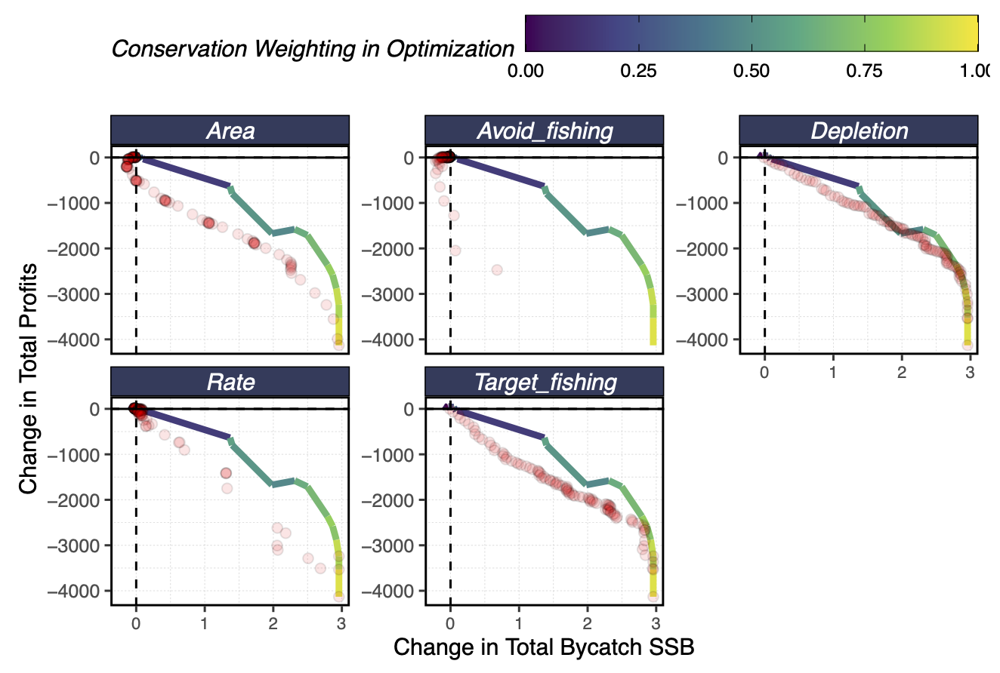

```{r xaringanExtra-freezeframe, echo=FALSE}

xaringanExtra::use_freezeframe(responsive = FALSE,overlay = TRUE)
```

```{r setup, include=FALSE}
library(xaringan)
library(xaringanExtra)
library(knitr)
library(tufte)
knitr::opts_chunk$set(echo = FALSE, message = FALSE, warning = FALSE, dev = "svg", fig.align = "center", out.width = "80%")
library(tidyverse)
library(here)

options(htmltools.dir.version = FALSE)


img_path <- here('imgs')
```

# A Quantiative Fisheries Ecologist


> I use methods and ideas from ecology and economics to help understand and manage social-ecological systems. 


I study...
  - Fisheries assessment and management
  - Social-ecological impacts of policies
  - Predictive modeling
  
Using...
  - Bayesian methods
  - Econometrics
  - Simulation modeling

Based on...
  - Open and reproducible science
  - Collaboration


---

class: center, middle, inverse
### A welcoming hub for interdisciplinary research on the <br> functioning and management of social-ecological systems


---

# Top Marine Predator Research

.pull-left[

- Fisheries management has had many successes

- Target and incidental catch threatens many top marine predators

- Damages oceans and people

- Solutions must address
  - Challenges of marine ecosystems
  - Human incentives 

].pull-right[




]


---


class: center, middle, inverse
# Coasean Approaches to Bigeye Overfishing<sup>*</sup>


.footnote[
*Yes, I know, we'll talk about it
]
---

# Bigeye & Skipjack Tuna in the <br> Western & Central Pacific Ocean

.pull-left[

**At the time we started this** Bigeye tuna (*Thunnus obesus*)
  
  * $F/F_{MSY}$ = 1.5
  * $B/B_{MSY}$ = 1, but presumably headed down
  
Large part of mortality caused by **incidental capture** of juvenile bigeye in purse-seine targeting skipjack tuna (*Katsuwonus pelamis*)

Problem was known for a long time
  - Why wasn't it solved?

].pull-right[

.center[]

.footnote[ISSF 2012]
]


---

# 

.center[]

.right[[Ovando *et al*. (2020)](https://www.journals.uchicago.edu/doi/10.1086/711853)]
---


## Is Overfishing Rational? 

* Bigeye catches needed to be reduced by ~33% to get to $F/F_{MSY}$ of 1
    * Requires 81% decrease in purse seine BET if reductions from PS alone

* Assuming a 6% bigeye rate for purse-seine...
    * Would require a **62%** reduction in targeted skipjack catch
    * At a cost of **$1.7 billion**: more than twice value of targeted bigeye

* Value of skipjack losses > entire value of targeted bigeye fishery

* Does this explain persistent overfishing?

---

# A Coasean Bargain

* Coase suggests an alternative solution
    * Markets allow costs and benefits to align
    * "Beneficiary pays" rather than "polluter pays"


<br>
<br>
<br>
<br>

.center[**What if bigeye tuna interests subsidized <br> FAD-free days in bigeye hotspots?**]

---

# Model


.center[]

.right[[Ovando *et al*. (2020)](https://www.journals.uchicago.edu/doi/10.1086/711853)]
---


# 

.center[]

.left[[Ovando *et al*. (2020)](https://www.journals.uchicago.edu/doi/10.1086/711853)]

---

# A Bargain for Tuna
.pull-left[

- Coasean analysis helps identify *imbalances in costs and benefits*

- Particularly for highly migratory species, can point out **bottlenecks**

- Direct fishery benefits to bigeye do not outweigh costs to skipjack

- But, provides floor for *willingness to pay*

- Changing $L_{\infty}$ not a solution we'd considered... 


].pull-right[


.footnote[Shane Gross/Minden Pictures]


]


---


class: center, middle, inverse
# Managing Mobile Species in a Dynamic Ocean

???

- Many marine top predators
  
  - Move large distances 
  
  - Have dynamic habitats
  
- Intersect with growing and changing demands from people

- Climate change shifting distributions
  


---


# MPAs & Marine Predators

> “Effective protected and conserved areas to cover at least 30% of the planet by 2030” (IUCN)

>“The Biden-Harris Administration’s policy, as written in Executive Order 14008, calls for the U.S. to conserve at least 30 percent of U.S. lands and waters by 2030”


- Growing call for MPAs to manage marine populations

<br>
<br>
<br>
<br>
.center[**How do we manage top marine predators in a dynamic ocean?**]

---

# MPAs and Marine Predators

.pull-left[

One strategy:
**Design MPAs that move with species**

  - Better bycatch outcomes
  
  - Lower fishery costs

The challenge... 
  - Incorporating dynamics of fish and fleets
  - Dynamic planning given imperfect information
  - Causal inference of spatial policies

].pull-right[
.center[]
]

---

# MPAs and Marine Predators


```{r, fig.align="center"}
include_url("https://danovando.github.io/marlin/")

```


---


# Effects of Spatial Policies


.center[]

---

# When Do Things Go Wrong?

.center[]


---


# Future Directions

.pull-left[

- Develop `marlin` as a platform for spatial policy evaluation

- Expand to
  - Marine mammals
  - Seabirds
  - Turtles
  
- Confront models with data
  - Effects of spatial policies
  - Tradeoffs between top predator conservation and fisheries

.center[**Developing solutions for managing top marine predators**]

].pull-right[

.center[]

]

---


# Teaching & Mentorship

Teaching is a core reason I want to be part of the UW

  - Revitalizing "Super advanced R"
  
  - Seeking out opportunity to teach FSH 323
  
I believe in **active** and **applied** learning
  
  - Fundamentals of open and reproducible science
  
  - Experience with real-world problem solving
  
  - Preparing students for careers in and out of Academia

<br>
.center[**Faculty have a responsibility to create <br> a welcoming and supportive community**]

---

# Funding Strategy

### Strong record of extramural funding
 
  - Doris Duke Conservation Fellow
  
  - NOAA Sea Grant Population and Ecosystem Dynamics Fellow

### Current Funding
  
  - NOAA Saltonstall-Kennedy Grant: Increasing U.S. Seafood Production through Effective Conservation of Bycatch Species
  
  - Food and Agriculture Organization of the United Nations
  
  - Bristol Bay Regional Seafood Development Association

---

# Funding Strategy

- Focus on collaborations with management bodies
  - NOAA
  - RFMOs

- NGOs & Foundations
  - Current funding and collaboration with TNC
  - Prior work with Waitt, Walton, Packard, Moore

- Industry
  - Fishing sector has incentive to support effective management
  - Tech sector untapped resource supporting big data and computation

- Support for **capacity building**

.center[**Collaborating with affected communities to fund and conduct research on conservation and management of top marine predators**]

???
National Catch Share Program and Magnuson-Stevens Act Implementation

North Pacific Research Board - focus on marine mammals, salmon in Alaska, salmon sharks

Build off of Global Fishing Watch partnership

https://www.fisheries.noaa.gov/alaska/ecosystems/shark-research-alaska

---


# Thank You!

.pull-left[
Questions?

slides: 

.small[[danovando.github.io/predators-uw/slides](https://danovando.github.io/predators-uw/slides)]

email: danovan@uw.edu

website: [danovando.com](https://www.weirdfishes.blog/)


<a href="https://twitter.com/danovand0?ref_src=twsrc%5Etfw" class="twitter-follow-button" data-show-count="false">Follow @danovand0</a><script async src="https://platform.twitter.com/widgets.js" charset="utf-8"></script>


].pull-right[

.center[]


]


---

class: center, middle, inverse
# Extras


---

# A Coasean Bargain

* Is regulation the only solution?
    
    * Resistance will be strong
    * Enforcement costs high

* Coase suggests an alternative solution
    * Markets allow costs and benefits to align
    * "Beneficiary pays" rather than "polluter pays"

* Can benefits of bigeye conservation outweigh costs?

  - Purse seine BET rate is low in aggregate
  - Hot-spots in space and time
  
.center[**What if bigeye tuna interests subsidized <br> FAD-free days in bigeye hotspots?**]

---

# MPAs and Marine Predators

.pull-left[

Critical dynamics to consider

- Marine species move

- Heterogeneous and dynamic habitat

- Fishing fleets respond

**How do these dynamics affect performance of static and dynamic MPAs**?

].pull-right[

```{r, out.width="100%", fig.align="center", eval = TRUE}
knitr::include_graphics(file.path(img_path,"bio_anim.gif"))
```


]


---

# Optimizing Spatial Policies

.center[]


---

